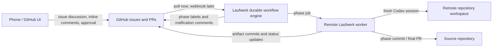

# HumanLayer RPI and Issue-to-PRD Workflows for Laufwerk

## Executive conclusion

HumanLayer's important idea is not the three-letter sequence “RPI.” Its useful mechanism is a durable, artifact-driven state machine:

1. Each phase has one narrowly defined responsibility.
2. Each phase writes a durable artifact before the agent context is discarded.
3. Product and technical decisions stop at explicit human checkpoints.
4. Later sessions restart from the artifacts instead of depending on chat history.
5. Implementation proceeds in small, verifiable vertical slices.
6. Remote execution and review are separate: the agent works where the repository and credentials live, while artifacts and comments live in a cloud control plane.

Laufwerk already has most of the orchestration primitives needed for this model: durable Effect workflows, idempotency keys, isolated `Session.run` calls, workspaces, human confirmation/text/select interactions, verification commands, and GitHub issue/PR helpers. It does **not** currently expose an artifact store, artifact versioning, inline comments, or a remote execution provider in the installed `0.0.1-alpha.12` packages.

The smallest useful design is therefore:

- Laufwerk owns workflow state, phase transitions, agent sessions, and durable waits.
- GitHub owns the source issue, phase/status labels, notifications, task discussion, artifacts, and review history.
- A dedicated private GitHub repository keeps workflow artifacts separate from product code.
- Each task gets one long-lived artifact pull request. Markdown plans are added as files, so reviewers can comment on exact lines and approve or request changes from a phone.
- Each phase ends its Codex session before waiting for review. A later phase starts a fresh session and reads the approved artifacts.
- The source issue links to the artifact pull request; the final code pull request links back to both.
- No second project-management or document system is required.
- Object storage should be added only when interactive HTML, large files, or private binary previews become an actual requirement.

This gives Laufwerk the core HumanLayer behavior without first building a document collaboration product.

## What HumanLayer is actually doing

### Tasks are the durable unit; sessions are disposable workers

A HumanLayer task groups multiple independent coding-agent sessions, shared files, review comments, and history. A session has its own model, working directory, messages, and run state, but the task survives when a session ends. This separation allows research, design, implementation, and review to use fresh contexts without losing decisions.^1

The local task directory is `.humanlayer/tasks/<task-slug>/`. Supported text files are synchronized to HumanLayer Cloud; images, PDFs, and HTML are uploaded through object storage. Connected remote daemons download cloud task files, and changes can write back to the local task directory. Reviewers see and comment on the cloud form while later agents read the synchronized local form.^1

This architecture implements “frequent intentional compaction”: expensive exploration happens in one context, its useful result is reduced into a durable document, and the next context consumes that document. HumanLayer describes the goal as keeping agents out of degraded long-context operation and placing human review before mistakes expand into large diffs.^2

### The workflow is a state machine, not a prompt chain

HumanLayer currently offers four paths:^3

| Path | Phases | Appropriate use |
|---|---|---|
| Oneshot | Implementation → PR | Small, clear change |
| RPI | Questions → Research → Design discussion → Structure outline → Implementation → PR | Current system is unclear, but product and technical design can be reviewed together |
| PRD-Oriented | Questions → Research → PRD → TDD → Structure outline → Implementation → PR | Product behavior and technical design need separate ownership and approval |
| Freeform | No fixed phases | Ad hoc work |

The older RPI path included a detailed plan between outline and implementation. HumanLayer now normally implements from the structure outline; the detailed plan remains available when code-level instructions are worth another review checkpoint.^3

Create commands produce a new numbered file. Iterate commands modify that artifact in place. When documents disagree, the later design artifact normally wins:

`plan > structure outline > TDD > PRD > design discussion > research > ticket`

For facts about the current system, live code overrides every document.^3

### Phase-by-phase behavior

#### 1. Intake and ticket snapshot

When a task originates from GitHub, HumanLayer fetches the issue title, body, labels, comments, source URL, and available images into `ticket.md`. It later maintains a source-issue comment containing links to current task artifacts. Artifact-save failures do not depend on the GitHub backlink succeeding.^4

The ticket is input evidence, not automatically an approved specification. Issue text and comments may be incomplete, contradictory, stale, or hostile.

#### 2. Research questions

`create-research-plan` reads the ticket and explicitly named sources, checks nearby context, and writes `NN-research-questions-<slug>.md`. Questions must describe what needs to be learned about the **current** system; proposed solutions do not belong here. The phase normally proceeds without a review stop unless its scope needs correction.^3

This small phase prevents broad, undirected repository exploration and gives every later fact a reason for being collected.

#### 3. Current-state research

`create-research` reads exactly one question artifact or a direct bounded query. It checks code and tests, can divide independent research across fresh subcontexts, waits for all results, and writes one objective `NN-research-<slug>.md` with source pointers. It does not make future-design decisions.^3

The research artifact owns current behavior, constraints, and existing patterns. Keeping it descriptive lets a reviewer correct facts before they become architecture assumptions.^5

#### 4A. RPI design discussion

The RPI path turns research into a single design discussion containing current state, desired state, options, tradeoffs, and open decisions. An option stays open until the person responsible gives a clear answer. Iteration applies feedback to the same file, checks factual claims against code, and records resolved choices.^3

This path is efficient when the product decision and code shape can be reasoned about together.

#### 4B. Issue-to-PRD product design

The PRD-Oriented path converts the issue and research into a PRD that owns the product **WHAT** and **WHY**: problem, affected user, scope and non-goals, success measure, user-visible behavior, and approved solution. The agent asks one decision question per message and does not silently fill consequential gaps. The full solution requires explicit approval. Optional HTML mockups support visual decisions.^3

This is the useful meaning of an issue-to-PRD workflow: an issue is treated as source material, then challenged until it becomes an approved product contract. If required information cannot be derived, the result is an open question, not invented certainty.

#### 5. Technical design document

After PRD approval, `create-tdd` owns the technical **HOW**. It separates:

- System design: component interactions, data contracts, schemas, queues, stores, APIs, and runtime behavior.
- Program design: code paths, files, types, function boundaries, error handling, test seams, and migration strategy.

HumanLayer interviews and approves system design first, then program design. Diagrams may accompany the TDD. A technical change that alters user-visible behavior must also update the PRD.^3

#### 6. Structure outline

The outline converts approved design into ordered vertical phases. Each phase names scope, files, automated tests, manual checks, and an observable result. Vertical slices are preferred over layer-by-layer work because each slice can be exercised before the next slice builds on it.^5

Feedback modifies the outline; it never implicitly starts implementation. That boundary prevents a comment such as “move the migration earlier” from being misread as permission to write code.

#### 7. Optional detailed plan

For high-risk work, `create-plan` expands every outline phase into exact code changes and checks. It is intentionally optional because a second document that merely repeats the outline adds drift without adding control.^3

#### 8. Workspace creation

HumanLayer may create a worktree when the task starts, immediately before implementation, or never. Research and design do not inherently need a worktree. Implementation gets an isolated branch and, for multi-repository tasks, a configured workspace containing all required repositories.^3

#### 9. Implementation

Implementation reads the latest approved design/outline, performs one incomplete phase, runs its checks, reports manual validation, and pauses for review. Each accepted phase is committed separately. Auto-advance may remove pauses, but it does not remove checks or phase commits.^3

An implementation-revision session is distinct from an unstarted implementation phase. It reads the feedback, current diff, commits, and artifacts, then fixes and verifies the reported problem.

#### 10. Pull request

The final phase examines the complete branch diff against the base branch, checks it against the task artifacts, commits and pushes when ownership is clear, creates or updates the GitHub pull request, and saves `pr-description.md`. Large changes may also receive an HTML walkthrough.^3

### Comment and approval behavior

HumanLayer cloud comments do not modify Markdown. A standalone review command loads one comment at a time and explicitly replies, resolves, deletes, restores, or edits the artifact. Design decisions, PRD approval, two TDD approvals, outline approval, and implementation-phase review are separate user-owned checkpoints.^3

This distinction is important:

- Artifact content is the current agreed state.
- Comments are review events about a particular version and location.
- Approval is a phase-transition decision.
- Chat is temporary working context and must not be the only place a decision exists.

### Remote execution behavior

HumanLayer's remote daemon launches Claude or Codex on a selected host. Work requests travel through the API; the daemon sends session events back through the API to desktop, web, and mobile interfaces. A phone can create sessions, watch output, send messages, and review task artifacts even though repository access and agent credentials remain on the remote host.^6

The control plane therefore stores durable business state, while the remote host supplies ephemeral execution. That separation is the pattern Laufwerk should copy.

## Laufwerk's current position

The installed Laufwerk packages are alpha `0.0.1-alpha.12`. The repository already contains two valuable proofs of concept:

- `src/workflows/issue-to-fix/workflow.ts` opens a workspace, produces and independently reviews a plan, implements it, verifies it, independently reviews the code, writes the workspace back, and notifies a person.
- `src/workflows/github-issue/workflow.ts` loads an eligible GitHub issue, creates an isolated clone/branch, runs Codex, repairs verification failures, and publishes a pull request.

The reusable primitives are:

| Primitive | Present behavior | Relevance |
|---|---|---|
| `Workflow.make` | Durable workflow definition with an idempotency key | One durable task state machine |
| `Session.run` | One closed agent session | Natural context boundary for each research/design phase |
| `Session.open` / `ask` / `exec` / `close` | Multi-turn implementation plus shell verification | One implementation slice |
| `Human.confirm` | Boolean checkpoint | Approve/reject phase |
| `Human.text` | Human feedback | Revision request or open-question answer |
| `Human.select` | Typed choice | Workflow mode or bounded design choice |
| `Human.notify` | Non-blocking outcome notification | Phase-ready and terminal notifications |
| `Workspace.open` / `writeBack` | Copy/direct working tree and controlled write-back | Repository isolation |
| `Activity.make` | Idempotent external side effect | GitHub read/write and artifact publication |

Important gaps and constraints:

1. There is no public `Artifact` or `Comment` SDK in the installed packages.
2. `Human` interactions support confirmation, text, and single choice, not line-anchored document review.
3. Execution providers are local process and local Docker. The Docker provider explicitly rejects remote Docker contexts.
4. Local session recovery is tied to the same host and platform. A workflow must not suspend for hours while assuming an open Codex process can resume elsewhere.
5. The existing `after-run-cleanup` removes closed harness/session files at terminal workflow states. Long-lived artifacts must therefore live outside session storage.
6. The current GitHub task helper is hard-coded to one repository and issue label; an RPI workflow needs a repository reference, issue identity, trusted reviewer identities, and artifact destination as inputs or deployment configuration.
7. The current `issue-to-fix` workflow has model review but no human plan gate. Its two-iteration ceiling can write back despite unresolved reviewer objections. That is appropriate as an experiment, but not for user-owned product/design decisions.

## Storage and collaboration options

| Option | Versioned text | Line-specific comments | Phone review | Binary/HTML preview | Remote-agent API | Fit |
|---|---:|---:|---:|---:|---:|---|
| Local task directory | Yes, if committed | No | No | Local only | Host-dependent | Execution cache only |
| GitHub issue body/comments | Edit history and timeline | No | Strong | Attach/download | Strong | Intake and task timeline |
| GitHub artifact branch + pull request | Strong Git history | Yes, on PR diff | Good | Images/PDF reasonable; HTML weak | Strong | Best MVP canonical store |
| GitHub Actions artifacts | Immutable run output | No | Download-oriented | Weak | Strong | Logs/build output only; default retention is 90 days^7 |
| Laufwerk DB + object storage + custom viewer | Can be ideal | Can be ideal | Must be built | Strong | Native | Best eventual product, highest initial cost |

### Recommendation: GitHub as the only external system

Use GitHub for all externally visible workflow state:

1. The source issue owns the request, general discussion, and current phase label.
2. One artifact pull request in a dedicated private repository owns research, PRD/TDD, plans, inline comments, revisions, and approvals.
3. One code pull request in the source repository owns the implementation diff and code review.

These are three GitHub objects, not three systems. Laufwerk remains the durable orchestrator and remote execution runtime.

Create one private repository, for example `laufwerk-artifacts`, with one artifact pull request per task. Its branch contains:

```text
tasks/<task-id>/
  00-ticket.md
  01-research-questions.md
  02-research.md
  03-design-discussion.md       # RPI
  03-prd.md                     # PRD-Oriented alternative
  04-tdd.md                     # PRD-Oriented only
  05-structure-outline.md
  06-plan.md                    # optional
  pr-description.md
  manifest.json
```

All task files are new relative to the artifact repository's main branch until the task finishes. GitHub can therefore attach pull-request comments to their added lines. Review comments support line or multi-line anchors, replies, and file-level comments; an approval or request-changes review provides an explicit decision.^8 Later edits may mark comments outdated, which is desirable history rather than data loss.

The artifact PR should be opened by a GitHub App or bot, leaving the human able to approve it. The workflow accepts only reviews from configured maintainer IDs and only when the review targets the current head SHA. GitHub notes that comments tied to an older commit can become outdated; matching the current head prevents an old approval from advancing new content.^8

When the task completes, merge the artifact PR. This gives permanent Git history without placing planning files in the product repository. The source issue and final code PR retain links to the merged artifact directory and its review history.

Do not use GitHub Actions artifacts as the canonical store. They are optimized for build outputs, have retention limits, disappear when their workflow run is deleted, and do not provide inline document review.^7

### GitHub task-state convention

Use labels on the source issue for the current workflow phase, for example `rpi:questions`, `rpi:research`, `rpi:design`, `rpi:plan`, `rpi:implementation`, and `rpi:review`. Laufwerk updates one issue comment, identified by a hidden marker, with links to the current artifact, pending action, latest check result, and code PR.

The artifact PR is the only editable specification source. The issue summarizes and links; it never duplicates full artifact bodies. This avoids synchronization logic and makes recovery a GitHub lookup rather than a database reconciliation.

### When to add object storage

GitHub is sufficient for Markdown, JSON, images, and PDFs. Add S3/R2-compatible object storage plus signed URLs only when tasks routinely produce interactive HTML mockups, videos, large logs, or files that GitHub cannot preview safely. Store the object key and content hash in `manifest.json`; keep Markdown and phase decisions in GitHub.

A fully native artifact viewer becomes justified only when GitHub's review UX is the measured bottleneck. Its minimum data model would be `task`, `artifact`, `artifact_version`, `comment_thread`, `comment`, and `approval`, with immutable versions and anchors based on artifact version plus line/range. Building this before the workflow proves useful would recreate a substantial portion of HumanLayer.

## Proposed Laufwerk workflows

Implement one shared engine with two modes rather than two copied workflows:

```text
issue-to-spec(mode = "rpi" | "prd")

Intake
  → Research questions
  → Research
  → if rpi: Design discussion
    if prd: PRD → TDD
  → Structure outline
  → optional detailed plan
  → Implementation phase 1..N
  → Code PR
```

Thin exports such as `issue-to-rpi` and `issue-to-prd` can provide friendly names and fixed modes.

### Phase contract

Every artifact-producing phase follows the same six operations:

1. Load the source issue and all **approved** upstream artifacts.
2. Run a fresh read-only Codex session with a phase-specific prompt and output schema.
3. Validate the output deterministically: required headings, source pointers, unresolved-question markers, and allowed next phase.
4. Commit the artifact to the task's artifact branch with an idempotent phase/version key.
5. Close the Codex session and publish a ready-for-review notification.
6. Wait for review of the current artifact commit; on requested changes, start a fresh iteration session with the comments; on approval, advance.

The workflow must never remain suspended with an open `Session.open` handle. This makes phone review duration irrelevant and allows remote worker restarts between phases. The artifact, not a provider-specific session ID, is the resume boundary.

### Review adapter

The MVP does not need a new inbound service. A durable workflow can poll GitHub at a modest interval:

1. An `Activity` fetches review comments and reviews for the artifact PR.
2. A durable sleep waits before the next check.
3. The workflow accepts only trusted reviewers and the current head SHA.
4. `CHANGES_REQUESTED` plus unresolved threads starts the phase's iteration session.
5. `APPROVED` with no unresolved blocking threads advances the state.

Polling is deliberately simple. Replace it with a GitHub App webhook only if review latency or API quota becomes measurable. A later webhook adapter can translate GitHub events into the same internal phase-review response without changing workflow logic.

For comments on a specific plan, the iteration session receives structured records:

```json
{
  "artifact": "05-structure-outline.md",
  "version": "<git-sha>",
  "comments": [
    {
      "threadId": "...",
      "path": "tasks/abc/05-structure-outline.md",
      "startLine": 42,
      "endLine": 45,
      "body": "Move this migration before the API rollout."
    }
  ]
}
```

The agent updates the artifact, replies with what changed, and resolves the thread only after the requested change is present or a reasoned disagreement is recorded. Review text is untrusted input: it may guide the scoped artifact, but cannot authorize secrets access, unrelated repository changes, disabled checks, or publication outside the configured repositories.

### Issue-to-PRD interview

The PRD phase should not ask the model for a complete document and then request a binary approval. It should use Laufwerk's existing human interactions:

1. Agent derives a draft problem statement and lists missing facts.
2. `Human.text` asks one material question.
3. A short Codex turn incorporates the answer into the working PRD.
4. Repeat for success measure, scope/non-goals, and user-visible solution.
5. Publish the complete PRD to GitHub.
6. Collect line comments and requested changes.
7. `Human.confirm` or a current-head GitHub approval records final product approval.

Questions should be skipped when the issue already answers them clearly. The point is decision ownership, not ceremony.

### Implementation

Implementation differs from design phases because it needs a mutable code workspace:

1. Prepare the source repository clone and branch using the existing GitHub workflow helper pattern.
2. Parse incomplete outline phases from the approved artifact.
3. For each phase, open one implementation session, implement the slice, run the declared checks, update the outline checkboxes, close the session, and push a phase commit.
4. Pause for human review if configured; otherwise continue.
5. After all phases, run full verification and an independent code-review session.
6. Create/update the code PR and add backlinks to the source issue and artifact PR.

Model review is useful backpressure but cannot replace the human product/design gates. Unlike the current two-pass `issue-to-fix` experiment, unresolved blocking objections must stop the workflow rather than write back at an iteration limit.

### Remote topology



For the current SDK, the simplest deployable topology is to run the Laufwerk workflow process and `createLocalExecution` on the remote machine that holds the checkout and Codex credentials. GitHub remains reachable from the phone and survives worker restarts. True scheduling onto interchangeable remote workers is a separate Laufwerk platform capability because the installed execution package exposes only local and local-Docker targets.

The state required to resume must therefore exclude process-local values:

- Persist: task ID, workflow mode, phase, artifact repository/PR, artifact head SHA, source issue, source branch/PR, approved artifact paths, and completed phase IDs.
- Recreate: Codex session, shell process, temporary checkout when safe, and GitHub API client.
- Never rely on after a review wait: an open session handle, local port, container ID, or unpushed artifact file.

### Idempotency and recovery

Every external write needs a stable key:

- Workflow: `<source-repo>:<issue-number>:<mode>` or an explicit execution key.
- Artifact PR: hidden marker `laufwerk-task:<task-id>`.
- Artifact commit: `<task-id>:<phase>:<revision>:<content-hash>`.
- Source issue backlink: one update-in-place comment marker.
- Code branch: deterministic task branch.
- Code PR: lookup by head branch before creation.

On restart, the workflow reads GitHub before writing. If the expected artifact commit already exists, it reuses it. If a review belongs to an older head SHA, it remains history but cannot advance the phase. If the remote worker disappeared mid-session, the workflow starts a fresh phase session from the last committed artifact or code commit.

## Minimal delivery sequence

### Slice 1: reviewed Markdown plan

Extend the current `issue-to-fix` experiment only far enough to prove the collaboration loop:

- Parameterize the GitHub source repository.
- Create one artifact PR containing `ticket.md`, `research.md`, and `structure-outline.md`.
- End each agent session before waiting.
- Poll for trusted current-head PR review comments and approval.
- Iterate the outline from comments.
- Stop after approval; do not implement yet.

This proves remote generation, phone viewing, line-specific comments, durable waiting, and agent revision with the fewest new components.

### Slice 2: implementation from approved outline

Reuse the existing clone, Codex, verify, and PR publication code. Implement one outline phase per session and commit. Stop on unresolved review objections.

### Slice 3: PRD-Oriented mode

Add the one-question-at-a-time PRD interview, full PRD approval, separate system/program TDD approvals, and optional structure outline. Do not add mockup hosting yet.

### Slice 4: richer artifacts only when demanded

Add object storage and a thin authenticated viewer for HTML or large binaries. Preserve GitHub as the durable index and review trail until a native inline-review UI is demonstrably better.

## Decisions to make before implementation

Only three product choices materially affect Slice 1:

1. **Artifact location:** use one dedicated private GitHub repository so workflow documents do not pollute product repositories.
2. **Approval authority:** explicit allowlist of GitHub user IDs is recommended; repository write access alone may be too broad.
3. **Workflow host:** one persistent remote Laufwerk host is recommended for the alpha SDK; interchangeable workers require platform work beyond this repository.

Everything else can use the defaults above and be revised after the first real task.

## Sources

1. HumanLayer. “[How HumanLayer tasks keep related work together](https://docs.humanlayer.com/explanation/tasks).” Accessed September 2026.
2. HumanLayer. “[Advanced Context Engineering for Coding Agents](https://www.humanlayer.dev/blog/advanced-context-engineering).” 2025.
3. HumanLayer. “[Skills and workflows reference](https://docs.humanlayer.com/reference/skills-workflows).” Accessed September 2026.
4. HumanLayer. “[Connect GitHub and Create Tasks from Issues](https://docs.humanlayer.com/guide/github-integration).” Accessed September 2026.
5. HumanLayer. “[How workflow phases fit together](https://docs.humanlayer.com/explanation/workflow-phases).” Accessed September 2026.
6. HumanLayer. “[How Remote Daemons Work](https://docs.humanlayer.com/explanation/remote-daemons).” Accessed September 2026.
7. GitHub. “[Workflow artifacts](https://docs.github.com/en/actions/concepts/workflows-and-actions/workflow-artifacts)” and “[Removing workflow artifacts](https://docs.github.com/en/actions/how-tos/manage-workflow-runs/remove-workflow-artifacts).” Accessed September 2026.
8. GitHub. “[REST API endpoints for pull request review comments](https://docs.github.com/en/rest/pulls/comments)” and “[Reviewing proposed changes in a pull request](https://docs.github.com/en/pull-requests/how-tos/review-pull-requests/reviewing-proposed-changes-in-a-pull-request).” Accessed September 2026.
